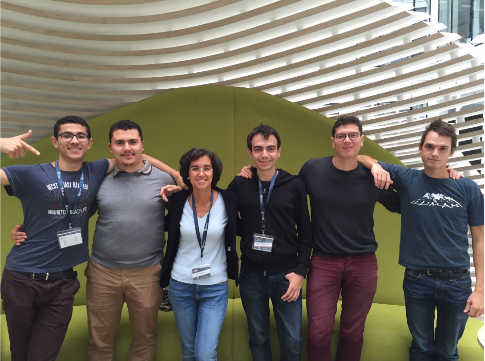

# Smart Flow 
_Fluid traffic for better cities._

Forked from [Road Traffic Simulator](http://volkhin.com/RoadTrafficSimulator)

This was part of a bootcamp projet to minimize traffic jams in a given city by using A.I. to control traffic lighters. 

## Demo

* Mouse and wheel - scrolling and zoom
* shift + click -- create intersection
* shift + drag from one intersection to another -- create road

Or just press generateMap in control panel and add cars with carsNumber slider.

## To run simulator

    git clone https://github.com/abyoussef/SmartFlow
    cd SmartFlow
    npm install

And open index.html in your browser. Use **gulp** to rebuild project.

## The team 

 
